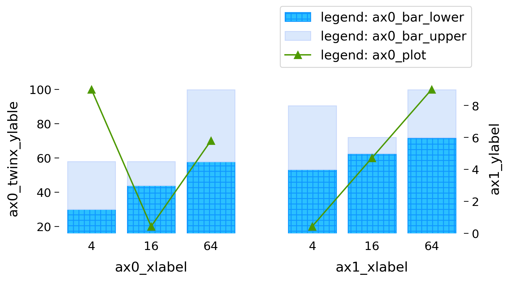

# matplotlib-templates
Some templates for experimental plots.

## Enviornment

python 3.7

### Using default colors of a style

```python
import matplotlib
import matplotlib.pyplot as plt
import numpy as np

plt.style.use('ggplot')

default_colors = []
for i, color in enumerate(plt.rcParams['axes.prop_cycle']):
    default_colors.append(color["color"])
    print(color["color"], type(color["color"]))

print(default_colors[0], type(default_colors[0]))

""" e.g.
rects_CPU_47  = ax0.bar(x - width/2, latency_CPU_total_47, width, color=default_colors[0])
"""
```


## bar_and_plot




## plot

3 variables: x, y, curve


## plot_fill

3 variables: x, y, curve


## bar_horizontal


## bar_horizontal_percentage


## grouped_bar


## stacked_grouped_bar


