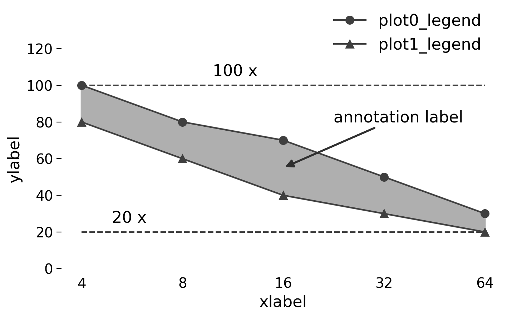

# matplotlib-templates
Some templates for experimental plots.

## Enviornment

python 3.7

## bar_and_plot

## plot

3 variables: x, y, curve

## plot_fill

3 variables: x, y, curve

## bar_horizontal

## bar_horizontal_percentage

## grouped_bar

## stacked_grouped_bar

